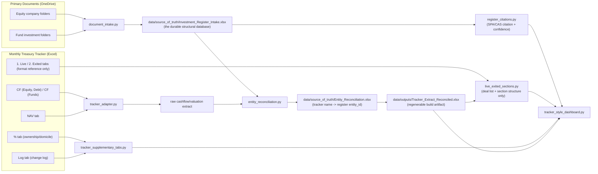

# System Architecture (V1, as implemented)

Date: 2026-08-18
Status: Living document - reflects the real-data pipeline as built, not an
aspirational target. Update this alongside code changes, not after the fact.

This describes how the V1 real-data pipeline actually works today
(`src/backend/im_platform/`), and the reasoning behind the two-source-of-
truth design. See PRD_v1.md section 19.4 for the policy this implements.

## 1. Why two sources of truth

- **Original transaction/legal documents** (SPAs, Subscription Agreements,
  Capital Account Statements, Capital Call/Distribution Notices, Side
  Letters) are authoritative for **structural facts**: which entity we
  invested through, what instrument/series, how much was committed, and
  when. These facts do not change once signed.
- **The monthly Treasury tracker** (a manually-maintained Excel workbook)
  is authoritative for **cash flow timing/amounts and NAV/valuation
  marks** - i.e. what actually happened and what something is worth today.
  These do change every month and are Treasury/Valuation's job to
  maintain, not something this platform should re-derive independently.
- The tracker's own report tabs (e.g. "1. Live" / "2. Exited") were
  initially (incorrectly) used as a data source for derived metrics too.
  This was corrected: the tracker's report layout is a useful **format**
  reference, but Committed/Invested/Remaining/Distributions/Carrying
  Value/Gain/TVPI/IRR are now computed independently from the register +
  cash flow extract + NAV extract, per the formulas in section 5.

## 2. Pipeline stages

## 3. Adapters and responsibilities

| Module | Responsibility |
|---|---|
| `document_intake.py` | Scans investment document folders, extracts text (OCR fallback via Tesseract), builds the structural register draft with a `confirmed_by` citation per row. |
| `tracker_adapter.py` | Extracts cash flow (`CF (Equity, Debt)`, `CF (Funds)`) and valuations (`NAV`) from the tracker - the ONLY tabs treated as authoritative input from the tracker. |
| `entity_reconciliation.py` | Maps free-text tracker names to confirmed register `entity_id`s, preserving prior confirmations across re-runs. |
| `register_views.py` | Rollup views over the register (by `entity_id` or `fund_vehicle_id`), with sub-vehicle-aware valuation summing. |
| `register_citations.py` | Joins the tracker's own deal list back to the register's primary-source citations (investing entity, commitment amount, instrument/series, close date), with honest confidence phrasing (`short_citation`). |
| `live_exited_sections.py` | Parses the tracker's Live/Exited tabs for deal list/section/status (format reference), then **recomputes** Committed/Invested/Remaining/Distributions/Carrying/Gain/TVPI/IRR from the register + cash flows + NAV (`recompute_deal_financials`, `enrich_with_irr`, `compute_section_irr`). |
| `tracker_supplementary_tabs.py` | Historical NAV series (scans prior monthly tracker snapshots), ownership %/domiciliation, tracker's own change log. |
| `entity_glossary.py` | Clean display names for entities whose `entity_id` carries folder-derived artifacts (numeric prefixes, internal codenames, ticker-style names). |
| `scan_for_updates.py` | Detects new company/fund folders, and file-level added/modified/deleted/renamed-or-moved changes (manifest diff by path/size/mtime, with a same-size heuristic pairing deletions to additions as likely renames), each with a plain-English note on likely report impact - NOT auto-triggered (a static HTML dashboard cannot invoke a local process; run from a terminal, at the start of every session and before month-end reporting). |
| `tracker_style_dashboard.py` | Renders the HTML dashboard: sectioned Live/Exited tables (tracker format, register+cashflow+NAV data), All Cashflows, Ownership, Log, Portfolio Growth (historical NAV + quarterly cash flow charts), Data Quality & Triangulation, Glossary. Every data cell carries a hover citation. |
| `output_pack.py` | V1 Output Pack Excel workbook + Markdown summary note (a separate, spec-driven deliverable per `V1_Output_Pack_Spec.md`). |
| `calculations.py` | Core XIRR solver and portfolio snapshot/returns summary calculations shared across dashboard and output pack. |

## 4. Key artifacts

Two folders under `data/`, split by a simple rule: **if it's durable,
hand-verified, or accumulates state across runs, it lives in
`source_of_truth/` and is never silently regenerated wholesale. If it's a
report/build artifact fully reproducible from `source_of_truth/` plus the
current tracker file, it lives in `outputs/` and is safe to delete at any
time.**

### `data/source_of_truth/` (durable - never wholesale-regenerated)

| File | Role |
|---|---|
| `Investment_Register_Intake.xlsx` | The durable structural database. `Investment_Register_Draft` sheet, one row per commitment/tranche, each with a `confirmed_by` citation. Built once from documents, then appended to/corrected in place - never rebuilt from scratch by a normal run. |
| `Entity_Reconciliation.xlsx` | Tracker free-text name -> register `entity_id` mapping, with `parent_fund_folder` for fund sub-vehicles. `reconcile-entities` preserves prior confirmations across re-runs. |
| `Document_Manifest.json` | Baseline file manifest (path/size/mtime) for change detection - deleting this makes `scan-for-updates` treat every existing document as new. |
| `Cashflow_SourceOfTruth_<date>.xlsx` | Dated, frozen cash flow + valuation snapshot, manually taken from the tracker at a point in time. Not yet wired as a CLI default input (still a manual copy) - intended to let reporting pin to a known-good extract instead of whatever the "current" tracker file happens to contain. |

### `data/outputs/` (regenerable - safe to delete, rebuilt by CLI commands)

| File | Role |
|---|---|
| `Tracker_Extract_Preview.xlsx` / `Tracker_Extract_Reconciled.xlsx` | Cash flow + valuation extract, rebuilt from the tracker file and `Entity_Reconciliation.xlsx` on every `extract-tracker` / `apply-reconciliation` run. **Known gotcha**: `apply-reconciliation` rebuilds this from scratch, so any manually-added row (e.g. `MANUAL-VAL-0001` for MGX Denali) must be re-added after every run. |
| `Update_Scan_Report.json` | Last `scan-for-updates` run's findings (new folders, new/modified files, likely impact) - a report, rebuilt each scan. |
| `Tracker_Style_Dashboard.html` | The current, primary reporting deliverable. |
| `V1_Output_Pack.xlsx` / `V1_Output_Pack_Summary_Note.md` | Spec-driven output pack (separate track from the dashboard). |

## 5. Derived metric formulas (verified against the tracker's own logic)

- `Invested` = sum of cash deployments from dated cash flows (register-
  confirmed entity -> cashflow join), not the tracker's own report figure.
- `Distributions` = sum of cash distributions from dated cash flows.
- `Carrying Value` = latest mark from the NAV tab.
- `Committed` = register's primary-source commitment amount; falls back to
  the tracker's own figure only when no primary source is confirmed yet
  (and is flagged as such).
- `Remaining` = Committed - Invested.
- `Gain` = Carrying Value + Distributions - Invested.
- `TVPI` = (Distributions + Carrying Value) / Invested.
- `IRR` (deal and section/pooled level) = XIRR over the same dated cash
  flows, with the latest NAV mark as a terminal cash flow.

## 6. Known limitations (as of 2026-08-16)

- Some fund-level tracker figures are computed from raw cash flow sums
  here, which legitimately differs from the tracker's own bespoke
  per-fund tabs - not a bug, but a real, flagged divergence pending a
  deeper fund-specific review (explicitly deferred by the user as a
  separate workstream, tracked by name in repo memory, not here).
  the tracker's own report vs the computed figures are surfaced in the Data
  Quality & Triangulation tab, not silently reconciled.
- Several equity investments still carry only a shallow ("AI-extracted")
  citation rather than a verified signed-document citation - each is
  visibly flagged in the dashboard (not hidden) and is being worked
  through one at a time.
- Document deep-linking (jump to the exact page/clause referenced) is
  scoped but not yet built - see PRD_CHANGELOG.md for the feasibility
  assessment (page-level linking is planned; exact-clause highlighting is
  not reliable for scanned/OCR'd documents or DOCX sources).
- `Governance_and_Control` and `Monitoring_Summary` (per
  `V1_Output_Pack_Spec.md`) remain placeholders - no IC/governance decision
  or monthly KPI/covenant input dataset has been built yet.

## 7. Session updates (2026-08-17/18)

- **Fund vehicles that aren't in the tracker's own Live/Exited tabs**: a
  fund can have a co-invest/sub-vehicle with no line item there at all
  (unlike its sibling vehicles under the same fund family), so it was
  silently missing from the dashboard's main deal table even though it
  was fully tracked in the register and valuation extract. `cli.py`'s
  `_generate_tracker_dashboard_command` now injects a synthetic deal row
  for any such vehicle, with its Committed/Invested/Carrying Value still
  recomputed from the register + cashflow + valuation extract exactly like
  every other row (never hardcoded). A configurable fixed display-order
  override can also be applied within a fund family's section, for cases
  where the user has a preferred presentation sequence that doesn't match
  the tracker's own row order.
- **Fund NAV/commitment roll-forward methodology** (between a fund's
  quarterly Capital Account Statement mark and the platform's monthly
  reporting cadence): interim NAV = last quarter-end CAS NAV +
  contributions/capital calls since quarter-end - distributions since
  quarter-end (a pure cash roll-forward, not a new appraisal); cumulative
  paid-in capital increases by the same amount. Ad hoc Treasury-reported
  interim capital calls get their own dated cashflow row (citing the
  communication) rather than being folded silently into the NAV number.
  When a capital call isn't labelled with which fund vehicle it belongs to,
  triangulate using each vehicle's remaining unfunded commitment capacity
  (from the CAS) rather than guessing - a vehicle that's already fully/
  near-fully called cannot have generated a large new call.
- **Cashflow sign convention reminder** (real bug hit 2026-08-17):
  `recompute_deal_financials` buckets cash flow purely by sign - negative
  amounts sum into Invested, positive amounts into Distributions,
  regardless of the `flow_type` label. Any new cashflow row for a capital
  call/deployment MUST be entered as negative, or it silently miscounts as
  a distribution instead.
- **Dashboard tooltip CSS bug**: `.panel`'s `overflow-x: auto` forced
  `overflow-y` to also clip (per the CSS overflow spec, an element can't
  have one axis clip and the other stay fully visible), cutting off the
  absolutely-positioned hover-tooltip popups on data cells. Fixed by
  moving horizontal scroll to a dedicated `.table-scroll` wrapper around
  each `<table>` instead of applying it to the whole `.panel`.
