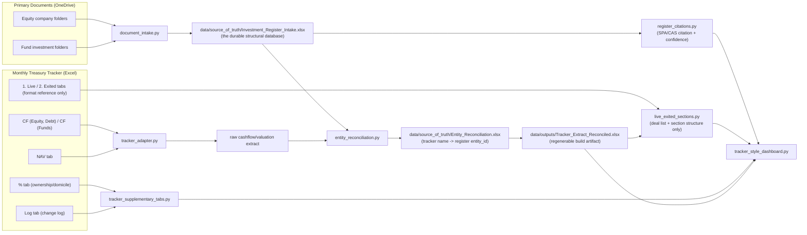

# System Architecture (V1, as implemented)

Date: 2026-08-18
Status: Living document - reflects the real-data pipeline as built, not an
aspirational target. Update this alongside code changes, not after the fact.

This describes how the V1 real-data pipeline actually works today
(`src/backend/im_platform/`), and the reasoning behind the two-source-of-
truth design. See PRD_v1.md section 19.4 for the policy this implements.

## 1. Why two sources of truth

- **Original transaction/legal documents** (SPAs, Subscription Agreements,
  Capital Account Statements, Capital Call/Distribution Notices, Side
  Letters) are authoritative for **structural facts**: which entity we
  invested through, what instrument/series, how much was committed, and
  when. These facts do not change once signed.
- **The monthly Treasury tracker** (a manually-maintained Excel workbook)
  is authoritative for **cash flow timing/amounts and NAV/valuation
  marks** - i.e. what actually happened and what something is worth today.
  These do change every month and are Treasury/Valuation's job to
  maintain, not something this platform should re-derive independently.
- The tracker's own report tabs (e.g. "1. Live" / "2. Exited") were
  initially (incorrectly) used as a data source for derived metrics too.
  This was corrected: the tracker's report layout is a useful **format**
  reference, but Committed/Invested/Remaining/Distributions/Carrying
  Value/Gain/TVPI/IRR are now computed independently from the register +
  cash flow extract + NAV extract, per the formulas in section 5.

## 2. Pipeline stages

## 3. Adapters and responsibilities

| Module | Responsibility |
|---|---|
| `document_intake.py` | Scans investment document folders, extracts text (OCR fallback via Tesseract), builds the structural register draft with a `confirmed_by` citation per row. |
| `tracker_adapter.py` | Extracts cash flow (`CF (Equity, Debt)`, `CF (Funds)`) and valuations (`NAV`) from the tracker - the ONLY tabs treated as authoritative input from the tracker. |
| `entity_reconciliation.py` | Maps free-text tracker names to confirmed register `entity_id`s, preserving prior confirmations across re-runs. |
| `register_views.py` | Rollup views over the register (by `entity_id` or `fund_vehicle_id`), with sub-vehicle-aware valuation summing. |
| `register_citations.py` | Joins the tracker's own deal list back to the register's primary-source citations (investing entity, commitment amount, instrument/series, close date), with honest confidence phrasing (`short_citation`). |
| `live_exited_sections.py` | Parses the tracker's Live/Exited tabs for deal list/section/status (format reference), then **recomputes** Committed/Invested/Remaining/Distributions/Carrying/Gain/TVPI/IRR from the register + cash flows + NAV (`recompute_deal_financials`, `enrich_with_irr`, `compute_section_irr`). |
| `tracker_supplementary_tabs.py` | Historical NAV series (scans prior monthly tracker snapshots), ownership %/domiciliation, tracker's own change log. |
| `entity_glossary.py` | Clean display names for entities whose `entity_id` carries folder-derived artifacts (numeric prefixes, internal codenames, ticker-style names). |
| `scan_for_updates.py` | Detects new company/fund folders, and file-level added/modified/deleted/renamed-or-moved changes (manifest diff by path/size/mtime, with a same-size heuristic pairing deletions to additions as likely renames), each with a plain-English note on likely report impact - NOT auto-triggered (a static HTML dashboard cannot invoke a local process; run from a terminal, at the start of every session and before month-end reporting). |
| `monthly_snapshot.py` | Persists the final post-recomputed per-deal monthly snapshot history and computes the latest period-over-period diff from the two most recent snapshot months. |
| `tracker_style_dashboard.py` | Renders the HTML dashboard: sectioned Live/Exited tables (tracker format, register+cashflow+NAV data), All Cashflows, Ownership, Log, Portfolio Growth (historical NAV + quarterly cash flow charts), Monthly Diff, Data Quality & Triangulation, Glossary. Every data cell carries a hover citation. |
| `output_pack.py` | V1 Output Pack Excel workbook + Markdown summary note (a separate, spec-driven deliverable per `V1_Output_Pack_Spec.md`). |
| `calculations.py` | Core XIRR solver and portfolio snapshot/returns summary calculations shared across dashboard and output pack. |

## 4. Key artifacts

Two folders under `data/`, split by a simple rule: **if it's durable,
hand-verified, or accumulates state across runs, it lives in
`source_of_truth/` and is never silently regenerated wholesale. If it's a
report/build artifact fully reproducible from `source_of_truth/` plus the
current tracker file, it lives in `outputs/` and is safe to delete at any
time.**

### `data/source_of_truth/` (durable - never wholesale-regenerated)

| File | Role |
|---|---|
| `Investment_Register_Intake.xlsx` | The durable structural database. `Investment_Register_Draft` sheet, one row per commitment/tranche, each with a `confirmed_by` citation. Built once from documents, then appended to/corrected in place - never rebuilt from scratch by a normal run. |
| `Entity_Reconciliation.xlsx` | Tracker free-text name -> register `entity_id` mapping, with `parent_fund_folder` for fund sub-vehicles. `reconcile-entities` preserves prior confirmations across re-runs. |
| `Document_Manifest.json` | Baseline file manifest (path/size/mtime) for change detection - deleting this makes `scan-for-updates` treat every existing document as new. |
| `Cashflow_SourceOfTruth_<date>.xlsx` | Dated, frozen cash flow + valuation snapshot, manually taken from the tracker at a point in time. Not yet wired as a CLI default input (still a manual copy) - intended to let reporting pin to a known-good extract instead of whatever the "current" tracker file happens to contain. |
| `Portfolio_Snapshot_History.xlsx` | Cumulative per-deal, per-month snapshot history written by `generate-tracker-dashboard`. Uses final post-correction figures after register/cashflow/NAV recomputation, not the tracker's raw report-tab outputs. Same-month reruns replace that month's rows rather than appending duplicates. |

### `data/outputs/` (regenerable - safe to delete, rebuilt by CLI commands)

| File | Role |
|---|---|
| `Tracker_Extract_Preview.xlsx` / `Tracker_Extract_Reconciled.xlsx` | Cash flow + valuation extract, rebuilt from the tracker file and `Entity_Reconciliation.xlsx` on every `extract-tracker` / `apply-reconciliation` run. **Known gotcha**: `apply-reconciliation` rebuilds this from scratch, so any manually-added row (e.g. `MANUAL-VAL-0001` for MGX Denali) must be re-added after every run. |
| `Update_Scan_Report.json` | Last `scan-for-updates` run's findings (new folders, new/modified files, likely impact) - a report, rebuilt each scan. |
| `Tracker_Style_Dashboard.html` | The current, primary reporting deliverable. |
| `Portfolio_Monthly_Diff.xlsx` | Latest period-over-period review workbook, comparing the two most recent snapshot months and classifying New / Exited / Changed / Removed deals with per-metric deltas. |
| `V1_Output_Pack.xlsx` / `V1_Output_Pack_Summary_Note.md` | Spec-driven output pack (separate track from the dashboard). |

### `src/frontend/`

| File | Role |
|---|---|
| `streamlit_app.py` | Localhost app with browser login, snapshot month selector, portfolio snapshot table, and latest monthly diff view, reading only persisted snapshot/diff workbooks. |

## 5. Derived metric formulas (verified against the tracker's own logic)

- `Invested` = sum of cash deployments from dated cash flows (register-
  confirmed entity -> cashflow join), not the tracker's own report figure.
  Exception: for fund vehicles, the fund's own Capital Account Statement
  cumulative figure is used instead when confirmed to differ from (and
  supersede) the tracker cash-flow sum - see section 7.
- `Distributions` = sum of cash distributions from dated cash flows (same
  fund-vehicle exception as `Invested`, above).
- `Carrying Value` = latest mark from the NAV tab.
- `Committed` = register's primary-source commitment amount; falls back to
  the tracker's own figure only when no primary source is confirmed yet
  (and is flagged as such). A non-USD commitment amount is converted using
  a documented fixed rate when one has been confirmed (see section 8);
  otherwise it is excluded from the USD roll-up and flagged as understated
  rather than silently dropped. For a fully exited position, Committed is
  always pinned to Invested (no outstanding commitment can remain once a
  position has exited, regardless of the original commitment figure).
- `Remaining` = Committed - Invested.
- `Gain` = Carrying Value + Distributions - Invested.
- `TVPI` = (Distributions + Carrying Value) / Invested.
- `IRR` (deal and section/pooled level) = XIRR over the same dated cash
  flows, with the latest NAV mark as a terminal cash flow. A vintage-level
  IRR (pooling every deal that shares a commitment year, across both Live
  and Exited) is computed the same way - see section 9.

## 6. Known limitations (as of 2026-08-16)

- Some fund-level tracker figures are computed from raw cash flow sums
  here, which legitimately differs from the tracker's own bespoke
  per-fund tabs - not a bug, but a real, flagged divergence pending a
  deeper fund-specific review (explicitly deferred by the user as a
  separate workstream, tracked by name in repo memory, not here).
  the tracker's own report vs the computed figures are surfaced in the Data
  Quality & Triangulation tab, not silently reconciled.
- Several equity investments still carry only a shallow ("AI-extracted")
  citation rather than a verified signed-document citation - each is
  visibly flagged in the dashboard (not hidden) and is being worked
  through one at a time.
- Document deep-linking (jump to the exact page/clause referenced) is
  scoped but not yet built - see PRD_CHANGELOG.md for the feasibility
  assessment (page-level linking is planned; exact-clause highlighting is
  not reliable for scanned/OCR'd documents or DOCX sources).
- `Governance_and_Control` and `Monitoring_Summary` (per
  `V1_Output_Pack_Spec.md`) remain placeholders - no IC/governance decision
  or monthly KPI/covenant input dataset has been built yet.

## 7. Session updates (2026-08-17/18)

- **Fund cash flow primacy: Capital Account Statement over tracker cash
  flow rows.** For fund vehicles specifically (not direct equity/debt
  deals), the fund's own CAS/Limited Partner Statement cumulative
  Invested/Distributions is now treated as primary, overriding the sum of
  the tracker's own dated cash flow rows when the two are found to
  disagree. Found via a real case: some tracker fund-cashflow rows had
  mixed sign conventions (a capital-call reduction/equalization recorded
  as a positive amount, so it was wrongly bucketed as a gross distribution
  instead of netting against invested) - both Invested and Distributions
  were inflated by the same amount, while the NET position matched the
  CAS exactly to the dollar (strong evidence the transaction data was
  complete, just mis-bucketed in gross terms). Mechanism:
  `_FUND_CAS_CASHFLOW_OVERRIDES` in `live_exited_sections.py` (same
  pattern as `_COMMITTED_EQUALS_INVESTED_DEALS`) - `recompute_deal_
  financials` checks it first, falling back to the cash-flow-sum
  computation otherwise. The underlying dated tracker rows are never
  deleted (still feed the All Cashflows tab and IRR) even when overridden
  - verify the NET matches the CAS exactly before trusting an override.
- **Fund vehicles that aren't in the tracker's own Live/Exited tabs**: a
  fund can have a co-invest/sub-vehicle with no line item there at all
  (unlike its sibling vehicles under the same fund family), so it was
  silently missing from the dashboard's main deal table even though it
  was fully tracked in the register and valuation extract. `cli.py`'s
  `_generate_tracker_dashboard_command` now injects a synthetic deal row
  for any such vehicle, with its Committed/Invested/Carrying Value still
  recomputed from the register + cashflow + valuation extract exactly like
  every other row (never hardcoded). A configurable fixed display-order
  override can also be applied within a fund family's section, for cases
  where the user has a preferred presentation sequence that doesn't match
  the tracker's own row order.
- **Fund NAV/commitment roll-forward methodology** (between a fund's
  quarterly Capital Account Statement mark and the platform's monthly
  reporting cadence): interim NAV = last quarter-end CAS NAV +
  contributions/capital calls since quarter-end - distributions since
  quarter-end (a pure cash roll-forward, not a new appraisal); cumulative
  paid-in capital increases by the same amount. Ad hoc Treasury-reported
  interim capital calls get their own dated cashflow row (citing the
  communication) rather than being folded silently into the NAV number.
  When a capital call isn't labelled with which fund vehicle it belongs to,
  triangulate using each vehicle's remaining unfunded commitment capacity
  (from the CAS) rather than guessing - a vehicle that's already fully/
  near-fully called cannot have generated a large new call.
- **Cashflow sign convention reminder** (real bug hit 2026-08-17):
  `recompute_deal_financials` buckets cash flow purely by sign - negative
  amounts sum into Invested, positive amounts into Distributions,
  regardless of the `flow_type` label. Any new cashflow row for a capital
  call/deployment MUST be entered as negative, or it silently miscounts as
  a distribution instead.
- **Dashboard tooltip CSS bug**: `.panel`'s `overflow-x: auto` forced
  `overflow-y` to also clip (per the CSS overflow spec, an element can't
  have one axis clip and the other stay fully visible), cutting off the
  absolutely-positioned hover-tooltip popups on data cells. Fixed by
  moving horizontal scroll to a dedicated `.table-scroll` wrapper around
  each `<table>` instead of applying it to the whole `.panel`.

## 8. Session updates (2026-08-18, evening)

- **Non-USD fund figures need an explicit, sourced conversion rate - never
  a silent spot-rate substitution, and never a silent no-op either.** Two
  distinct bugs were found in the same fund vehicle: (1) a non-USD
  commitment amount was being fully excluded from every USD roll-up
  (correctly flagged as understated, but never actually resolved), and (2)
  a non-USD NAV/carrying-value mark was being divided by a million with
  no FX conversion applied at all, even though a valid FX rate already
  existed on that valuation record - a genuine latent bug, not a
  missing-data gap. Fixed by (a) adding an explicit, small keyed override
  for the fund's own fixed hedging/conversion rate (used only for that
  specific commitment, sourced and documented, not a blanket market-rate
  assumption), and (b) correcting the carrying-value computation to apply
  whatever FX rate is already present on the valuation row instead of
  ignoring it. **Structural takeaway**: any code path that converts/rolls
  up a monetary figure into USD must be checked for whether a rate field
  already exists on the record before assuming a conversion is missing -
  "exclude and flag" is an acceptable interim state, never a final one.
- **One tracker-level grouping can hide more than one legal entity.** Two
  distinct fund vehicles were sharing one internal grouping key, so one
  vehicle's commitment was being pooled into the other's citation/rollup
  even though the dashboard already displayed them as separate rows.
  Fixed using the same explicit per-entity mapping mechanism already used
  elsewhere for this exact class of problem, rather than a bespoke patch.
  **Structural takeaway**: the moment a tracker "deal" turns out to be
  more than one legal vehicle, add it to the existing explicit-mapping
  mechanism immediately.
- **A fund statement's own headline distribution figure can itself be
  incomplete by design** - refining the CAS-primacy policy from the prior
  session. A fund's summary distribution line was explicitly scoped to
  exclude a whole category of real cash payments to the investor (capital
  returned as later investors are admitted, plus interest earned on
  capital funded ahead of those investors) - both genuinely paid in cash,
  confirmed against the fund's own transaction-level notices, but neither
  counted in the statement's own headline total. Resolved by (a) trusting
  the fund's net cumulative-contributions figure as-is for Invested (it
  already nets out capital returned to the investor correctly), and (b)
  separately identifying and adding back only the portion that is real
  economic income (interest), verified line-by-line against every
  transaction notice to confirm it was actually paid in cash rather than
  merely netted against a still-outstanding capital call. **Structural
  takeaway**: a fund administrator's own summary line is not automatically
  complete just because it's the primary source - check what it's
  explicitly scoped to exclude, and reconcile against transaction-level
  detail before accepting a headline total.
- **OCR fallback gap**: the PDF text extraction fallback to OCR only
  triggers when extraction returns fully empty text - it does not detect
  "succeeded but garbled" extraction (some PDFs' embedded font encoding
  produces non-empty but nonsensical output). Widened practice: treat
  clearly non-language output as a signal to force OCR, not just empty
  output.

## 9. Session updates (2026-08-19)

- **Non-USD conversion rates are per-vehicle, not one global constant.**
  Two related vehicles under the same fund family were found to use two
  DIFFERENT fixed conversion factors (confirmed against each vehicle's own
  tracker-reported figures, not assumed) - reinforcing that the fixed-rate
  override mechanism introduced in section 8 must stay keyed per
  investment/vehicle, never applied as a single fund-family-wide constant.
- **When our own recomputed figure disagrees with the tracker's raw
  figure, check whether the tracker is actually the one that's right**
  before assuming the recompute pipeline is authoritative. The general
  policy (register/cash-flow recompute over the tracker's own report
  figures) is a default, not an absolute rule - in one case this session,
  the tracker's own raw Committed/Invested numbers turned out to already
  correctly reflect a vehicle's specific economics (paid in full upfront),
  while our own cash-flow-derived recompute had inherited an unconverted-
  currency bug. Resolution: verify independently (here, by reproducing the
  tracker's implied math from the register's own commitment figure) rather
  than defaulting to "our pipeline overrides the tracker" as an unquestioned
  rule.
- **New aggregation dimension: vintage year.** Deals can now be viewed
  grouped by vintage (commitment year) instead of investing entity,
  pooling across both Live and Exited status, with the same subtotal/
  grand-total/blended-IRR pattern already used for entity-based sections.
  This is a genuinely different cut of the same underlying per-deal data,
  not a new data source - implemented as an additional grouping function
  parallel to the existing entity-based one.
- **Curated/filtered views belong in their own additional tab, not as a
  destructive filter on an existing one.** When a user wants to see the
  portfolio with certain deals/positions excluded "just to see", the
  right pattern is a new, clearly-labelled tab reusing the same rendering
  function with a pre-filtered input, leaving the complete/unfiltered view
  untouched and still the default. Keeps exploratory views honest (clearly
  labelled as a subset) without fragmenting the underlying data model.
- **Monthly snapshot + period-over-period diff is now built into normal
  dashboard regeneration**: every `generate-tracker-dashboard` run writes
  the final corrected per-deal figures into the cumulative snapshot
  history, then computes the latest diff between the two most recent
  snapshot months. Snapshotting captures POST-correction figures, not the
  tracker's raw ones, and same-month reruns replace that month's rows so
  corrections do not create duplicate monthly records. The latest diff is
  written to an output workbook and rendered in the dashboard's Monthly
  Diff tab.
- **Historical snapshot backfill is deliberate, not manual workbook editing**:
  `backfill-monthly-snapshot` runs the same corrected deal-row computation
  against one or more historical tracker files, upserts those months into
  the durable history workbook, then rewrites the latest diff workbook.

